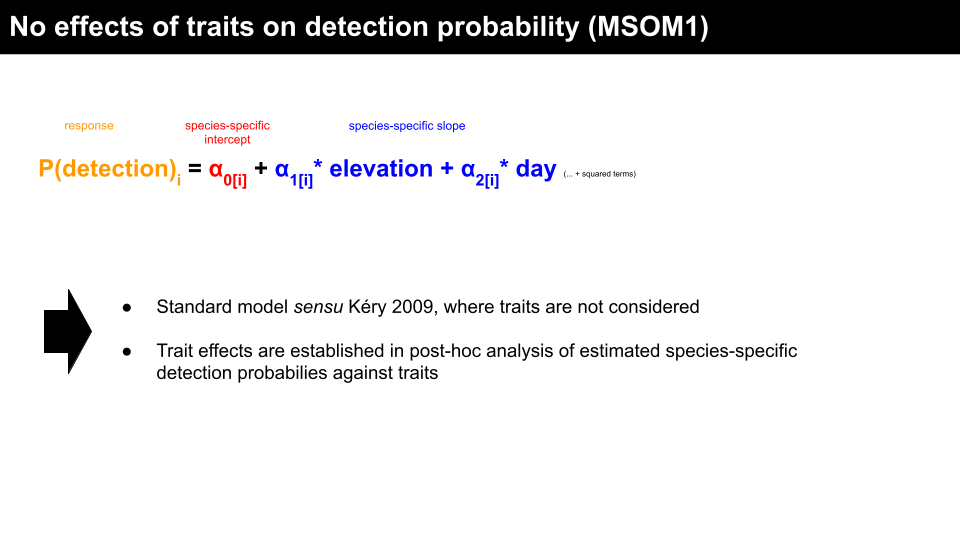
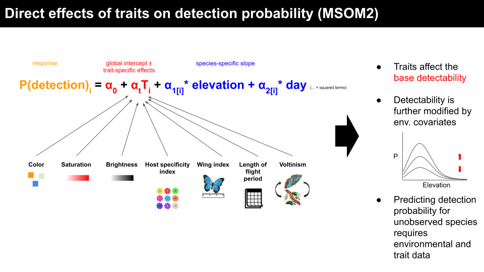
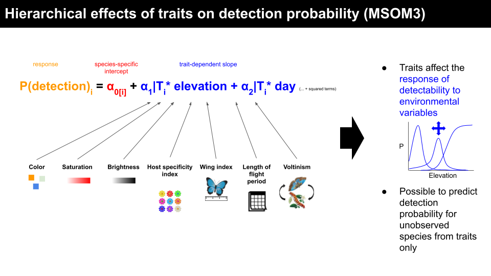
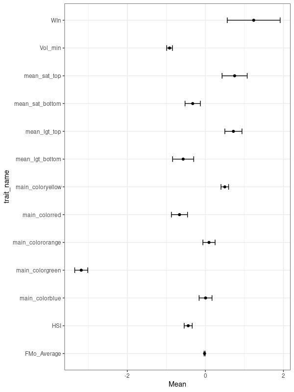

# Butterfly occupancy modeling

Bayesian multi-species detection-occupancy models for Swiss butterfly communities.

---------------------------------------------------------------

### Workflow
We analyse Swiss butteflies and ask whether phenotypical and life-history affect their detection probability of species in the field. To this end, we implement different versions of the multi-species occupancy model (MSOM) framework of [Kéry et al (2009)](#1). 

#### 1. Data preparation
*A detailed description of the data preparation is given in the accompanying manuscript.*

**Survey data:**
We obtained presence/absence data for day-flying Butterflies (including Hesperiidae and Zygaenidae) from the Swiss Biodiversity Monitoring (BDM, [BDM coordination office 2014](#2)). The BDM data are structured into primary samples (up to seven site visits per year) and secondary samples (during each visit, record observations separately for the ways back and forth along the transect). Since butterfly populations fluctuate within years, we derive detection probabilities from the secondary samples (robust design, [Kendall et al. 1997](#3)).

**Trait data:**
Morphological and life-history traits (voltinism, length of flight period, wing index, host plant specificity) were obtained from [Middleton-Welling et al. (2020)](#4). Traits describing the color and brightness of species were extracted from a dataset of scanned color images (see [Zeuss, 2017](#5)). 

**Environmental data:**
We selected five site specific variables to describe the environmental response of species: mean annual precipitation, radiation, number of days above 0°C, aspect, and slope.

**Taxonomic harmonization:**
We harmonized species names between the BDM data and the two trait datasets manually by searching the taxonomic literature and online resources.

The resulting dataset was filtered according to the following criteria:

* Observation was made during a standard BDM survey
* Observation was made between 2010 and 2014
* Species was observed in at least 30 unique site-year combinations
* Species has full set of traits available

The final dataset contained 58156 observations of 105 species in 469 sites.

#### 2. Model fitting 
*A detailed description of the model formulation is given in the accompanying manuscript.*

We implemented three different models to assess the effects of functional traits on the detection probability of species. These only differ with respect to the detection submodel:

**MSOM1:** 

**MSOM2:** 

**MSOM3:** 

The model implementations are found under `Butterfly_detection/jags_models`. Parameters are names according to the following conventions: `mu` and `tau` respectively refer to the mean and precision (1/variance) of a normally distributed stochastic node, `alpha` and `beta` respectively refer to parameters of the detection and the state model, `null` and `coef` respectively refer to intercept and slope terms, `env` and `trait` respectively refer to parameters related to environmental and trait variables.

After experimenting with different JAGS wrappers for R, we settled on the `runjags` package for fitting the three different models. Other than the previous step, **model fitting needs to be done on a compute cluster** as it is computationally very expensive. Each model is run as a separate compute job and, consequently, there are three separate files for model fitting (`2_fit_<model>.R`). These files need to be submitted via a shell script (`MSOM1.sh` - `MSOM3.sh`) to a node of the cluster that has the JAGS package installed. Caution, runtimes can be up to two weeks for 15000 MCMC iterations!

#### 3 DIC sampling
We use the deviance information criterion (DIC, [Spiegelhalter, 2002](#6)) for model comparison. The DIC cannot be calculated when running parallel chains, as the penalty term of the DIC is based on the variance among chains. A fresh sequential run of the model using the `runjags::extract()` function is required to sample the DIC. Again, **this needs to be done on the cluster** with the help of a shell script (`DIC_sampling.sh`). So far, is implemented only experimentally and long runtimes are to be expected. Playing around with the number of iterations and thinning rate in `runjags::extract()` is probably a good idea.

DICs of different models can later be compared using the `rjags::diffdic()` function.

#### 4. Model evaluation
For each model, we produce general summary statistics and assess convergence based on pruned and thinned MCMC chains (`burnin = 4000, thinning rate = 100`), leaving `4*100` samples per node. Additionally, we provide a convenience function to produce response plots of detection/occupancy probability against a given predictor variable.

#### 5. Analysis
The analysis is not well developed yet and may cover the following aspects:

* Comparison of model prediction error / goodness of fit using DIC
* Comparative analysis of trait effects on detection probability
* Aggregation of model predictions by family/conservation status/habitat etc --> Mapping?

An initial plot of the trait effects estimated by MSOM2 seems to be in agreement with hypothesis 1, although further investigation (higher detection probability for large, colourful species) is needed:

### Miscellaneous comments

* The folder `Butterfly_detection/deprecated` contains scripts that are currently not in use or have been superseded by alternative workflows.

### References

Kéry, M., Royle, J.A., Plattner, M. and Dorazio, R.M. (2009), Species richness and occupancy estimation in communities subject to temporary emigration. Ecology, 90: 1279-1290. https://doi.org/10.1890/07-1794.1

BDM coordination office (2014), Swiss Biodiversity Monitoring BDM. Federal Office for the Environment, Bern.

Kendall, W. L., Nichols, J. D. and Hines, J. E. (1997), Estimating Temporary Emigration Using Capture–Recapture Data with Pollock’s Robust Design. Ecology 78:563–578.

Middleton-Welling, J., Dapporto, L., García-Barros, E. et al. (2020), A new comprehensive trait database of European and Maghreb butterflies, Papilionoidea. Scientific Data, 7: 351. https://doi.org/10.1038/s41597-020-00697-7

Zeuss, D., Brunzel, S. and Brandl, R. (2017), Environmental drivers of voltinism and body size in insect assemblages across Europe. Global Ecol. Biogeogr., 26: 154-165. https://doi.org/10.1111/geb.12525

Spiegelhalter, D.J., Best, N.G., Carlin, B.P. and Van Der Linde, A. (2002), Bayesian measures of model complexity and fit. Journal of the Royal Statistical Society: Series B (Statistical Methodology), 64: 583-639. https://doi.org/10.1111/1467-9868.00353
